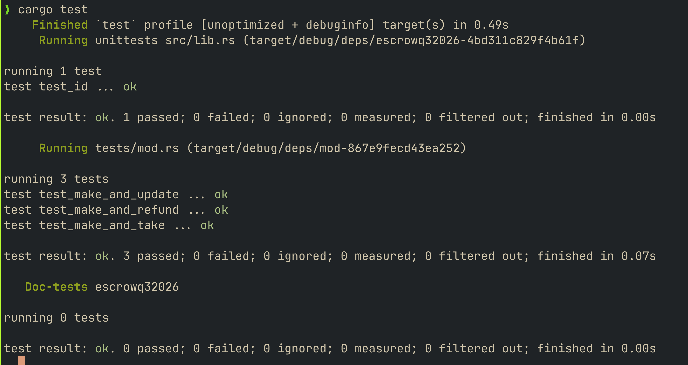

# Token escrow

An Anchor program for swapping two tokens on Solana. A maker deposits token A into a vault and sets how much token B they want. A taker accepts the offer by paying token B to the maker and receiving the deposited token A in the same transaction.

## Instructions

| Instruction | Who signs | What it does |
| --- | --- | --- |
| `make(seed, deposit, receive, expiration)` | Maker | Creates the escrow and vault, records the offer, and deposits token A. |
| `take()` | Taker | Pays the requested token B to the maker, transfers the vault's token A to the taker, and closes the escrow and vault. |
| `refund()` | Maker | Returns the vault's token A to the maker and closes the escrow and vault. |
| `update(receive, expiration)` | Maker | Changes the requested token B amount and expiration. The deposit stays in the vault. |

Amounts use the mint's smallest units. For a mint with six decimals, `10_000_000` represents 10 tokens. Expiration is a Unix timestamp in seconds.

## Rules

The escrow PDA controls the token vault. Its seeds are `b"escrow"`, the maker's public key, and the offer seed as little-endian bytes. Different seeds allow multiple offers per maker.

- Only the maker can update or refund. Refunds are allowed at any time.
- Taking is allowed up to and including the expiration timestamp.
- Updates require a positive requested amount and a future expiration. An expired offer can be reopened this way.
- The taker pays to create missing receiving token accounts. Closing the escrow and vault returns their rent to the maker.
- Both mints must use the same token program.

`make` currently accepts zero amounts and past deadlines; `update` rejects them.

## Build and test

With Rust, Solana CLI, and Anchor installed, run from this directory:

```sh
anchor build --ignore-keys
cargo test
```

Rebuild after changing the program code. Tests run locally using LiteSVM.

## Tests

The LiteSVM tests cover make/refund, make/update, and make/take, checking stored terms, token balances, and account closure. Failure cases and expiration boundaries are not yet covered.


